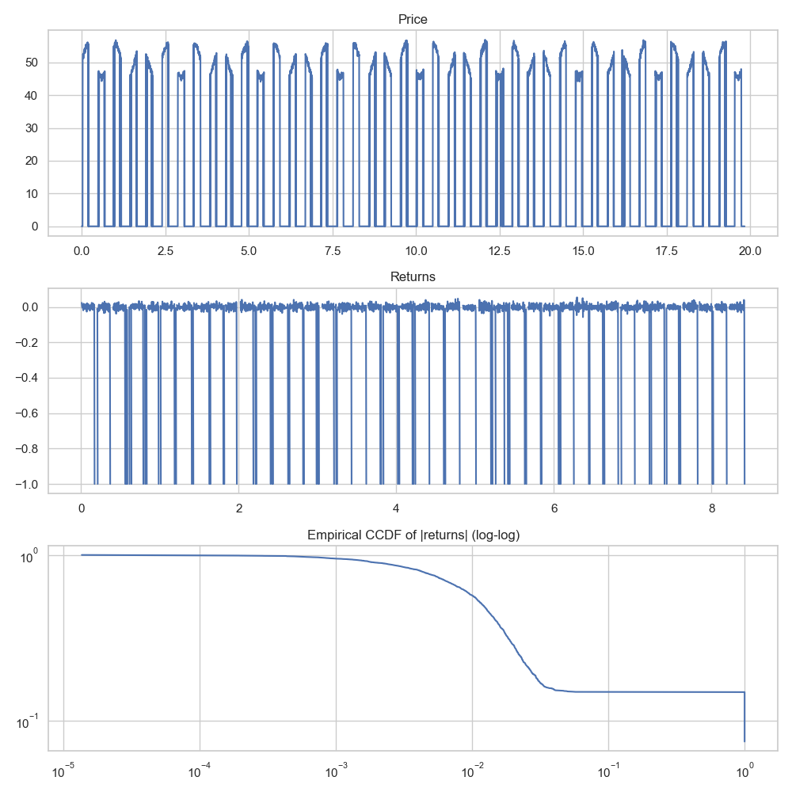
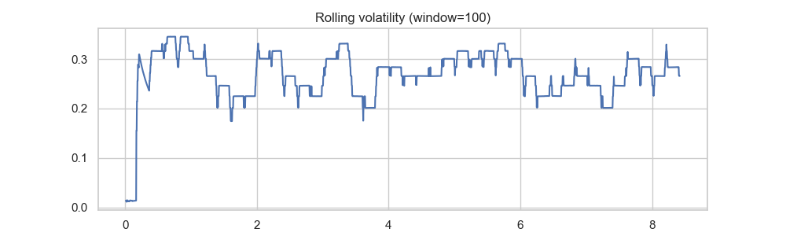

# Endogenous Liquidity & Market Fragility

Research repository implementing a continuous-time stochastic limit-order market with endogenous liquidity, leverage and margin dynamics. This codebase contains:

- `rust_simulator/` — Rust-based simulator (engine + CLI).
- `python/` — analysis tools, generators, notebooks, and experiment drivers.
- `docs/` — analytical notes and LaTeX model file.

Quick start

1. Build the simulator (requires Rust):

```bash
cd rust_simulator
cargo build --release
```

2. Run a short demo (writes `data/sim_demo.csv`):

```bash
./target/release/rust_simulator --steps 5000 --alpha 0.5 --beta 50 --gamma 1.0 --seed 42 --output ../data/sim_demo.csv
```

3. Analyze results (requires Python 3.9+):

```bash
python -m pip install -r python/requirements.txt
python python/analyze.py data/sim_demo.csv
```

Overview

- The simulator outputs CSV time series with columns: `t,price,depth,sigma,noise_flow,fund_flow,forced_flow,inventory,equity`.
- The Python folder contains tools to compute tail indices (Hill), a rough Hurst estimate, rolling volatility diagnostics, and notebooks for visualization.

## Methods (model)

This section gives the compact model specification used in the simulator and for analytical arguments. Equations are written in display math for portability.

State vector and primitives

The system state is

$$
X_t = (P_t, L_t, \sigma_t, q_i(t), \ell_i(t))
$$

where

- $P_t$ is the mid-price,
- $L_t$ is instantaneous market depth (liquidity),
- $\sigma_t$ is an endogenous volatility proxy,
- $q_i(t)$ and $\ell_i(t)$ are agent-level inventories and leverage.

Price formation

Price moves are driven by order imbalance $dI_t$ with an inverse-depth impact:

$$
dP_t = \frac{1}{L_t} \; dI_t.
$$

Liquidity dynamics

Liquidity providers adjust depth in response to realized risk and inventory pressures. In the deterministic skeleton we write:

$$
\frac{dL_t}{dt} = \alpha - \beta\,\sigma_t\,L_t - \gamma\,\mathrm{InventoryRisk}_t.
$$

Interpretation: higher volatility or larger inventory risk leads to liquidity withdrawal (lower $L_t$).

Endogenous volatility

We use an instantaneous volatility proxy based on order-flow variance and liquidity:

$$
\sigma_t^2 = \frac{\mathrm{Var}(dI_t)}{L_t^2}.
$$

Leverage and margin constraints

Agent leverage is defined by

$$
\ell_i(t) = \frac{\mathrm{Position}_i(t) \cdot P_t}{\mathrm{Equity}_i(t)}.
$$

If $\ell_i(t)>\ell_{\max}$ the agent is forced to deleverage, producing forced order flow $dI_t^{\mathrm{forced}}$ which can cascade through the system.

## Mathematical results (summary)

Equilibrium liquidity

At a steady state $(L^*,\sigma^*)$ the liquidity drift is zero:

$$
0 = \alpha - \beta\,\sigma^* L^* - \gamma\,\mathrm{IR}^*.
$$

Under a closure $\sigma^* = S / L^*$ with $S = \sqrt{\mathrm{Var}(dI_t)}$, the product $\sigma^* L^*=S$ and the above reduces to

$$
\alpha - \beta S - \gamma\,\mathrm{IR}^* = 0.
$$

Linear stability (informal)

For the coupling $\sigma_t = S/L_t$ we have $\delta\sigma_t = -\frac{S}{L^{*2}}\delta L_t$. The effective damping depends on inventory feedback and higher-order terms; delayed or nonlinear inventory feedback commonly produces negative damping and drives liquidity collapse (endogenous crises).

Fat tails (mechanism sketch)

Returns scale approximately as

$$
r \approx \frac{dI}{L}.
$$

If small-$L$ events follow a power-law tail $\Pr(L<\ell)\sim C\ell^{\kappa}$ then, even when $dI$ is thin-tailed, one gets for large $x$:

$$
\Pr(|r|>x) \approx \int_0^{\infty} \Pr(|dI|>x\ell) f_L(\ell) \, d\ell \sim x^{-\kappa}.
$$

Therefore multiplicative amplification by low-liquidity episodes can produce heavy-tailed returns.

## Results (demo run)

- Demo outputs included: `data/sim_demo.csv`.



**Figure:** Returns time series (log-returns). Interpretation: the series shows intermittent spikes; for the short demo the Hill tail estimate is noisy (NaN). Use larger Monte Carlo samples for robust tail estimates.



**Figure:** Rolling volatility (window=100). Interpretation: visible volatility clustering—periods of elevated volatility are consistent with endogenous liquidity withdrawal and amplification mechanisms in the model.

**Demo summary:** 4999 returns; short-run Hill estimate noisy; rough Hurst ≈ 0.52.

## External price-generation (piecewise rule)

The repository supports precomputing an external price driver via the piecewise rule:

$$
P_t = \begin{cases}
HR\cdot P^{gas}_t + \tau_t\cdot EI, & x_t > Q_{baseload}, \\
0, & x_t \le Q_{baseload},
\end{cases}
$$

where $HR$ is a scaling parameter, $P^{gas}_t$ is an exogenous gas-price series, $\tau_t$ a time-dependent weight, $EI$ an emissions/intensity index, $x_t$ an observed driver (e.g., demand), and $Q_{baseload}$ a threshold.

The Python helper `python/gen_external.py` creates `data/external.csv` with a `P_ext` column. The simulator accepts `--external <path>` and `--external-mode <replace|shock>` to either replace the endogenous price each step or add the external series as a shock.

## Usage notes

- Use `--external-mode replace` only when `P_ext>0` (log-returns require positive prices). Use `shock` to add the external series.
- For production experiments replace the ad-hoc CSV loader in the simulator with a robust CSV/serde reader supporting named columns.

## Reproduce demo

```bash
python python/gen_external.py --steps 5000 --out data/external.csv
cd rust_simulator
cargo build --release
cd ..
./rust_simulator/target/release/rust_simulator --steps 5000 --seed 123 --output data/sim_external.csv --external data/external.csv --external-mode replace
python python/analyze.py data/sim_external.csv
```

## Recent results (updated 2026-03-15)

- Demo run (`data/sim_demo.csv`): 4999 returns; Hill tail estimate: NaN (sample too small/noisy); rough Hurst ≈ 0.503.
- External-driven run (`data/sim_external.csv`): 2122 returns; Hill tail estimate: NaN; rough Hurst ≈ 0.269.

The analysis was produced with `python/analyze.py`, which now guards against non-positive prices and uses a robust returns computation. Plots were regenerated to `python/price_returns.png` and `python/rolling_vol.png`.

These short-run estimates are informative but noisy; run larger Monte Carlo experiments (10k+ steps/replicates) for stable tail-index estimates.

## Next steps

- Run large-scale Monte Carlo experiments (10k+ runs), aggregate tail-index and crisis-frequency statistics.
- Add richer agent types (Avellaneda–Stoikov market maker), funding-liquidity channels, and calibration to market data.

If you want, I will commit and push this README update now.
# Endogenous Liquidity & Market Fragility

Research repository implementing a continuous-time stochastic limit-order market with endogenous liquidity, leverage and margin dynamics. This codebase contains:

- `rust_simulator/` — Rust-based simulator (engine + CLI).
- `python/` — analysis tools, generators, notebooks, and experiment drivers.
- `docs/` — analytical notes and LaTeX model file.

Quick start

1. Build the simulator (requires Rust):

```bash
cd rust_simulator
cargo build --release
```

2. Run a short demo (writes `data/sim_demo.csv`):

```bash
./target/release/rust_simulator --steps 5000 --alpha 0.5 --beta 50 --gamma 1.0 --seed 42 --output ../data/sim_demo.csv
```

3. Analyze results (requires Python 3.9+):

```bash
python -m pip install -r python/requirements.txt
python python/analyze.py data/sim_demo.csv
```

Overview

- The simulator outputs CSV time series with columns: `t,price,depth,sigma,noise_flow,fund_flow,forced_flow,inventory,equity`.
- The Python folder contains tools to compute tail indices (Hill), a rough Hurst estimate, rolling volatility diagnostics, and notebooks for visualization.

## Methods (model)

This section gives the compact model specification used in the simulator and for analytical arguments. Equations are written in display math for portability.

State vector and primitives

The system state is

$$
X_t = (P_t, L_t, \sigma_t, q_i(t), \ell_i(t))
$$

where

- $P_t$ is the mid-price,
- $L_t$ is instantaneous market depth (liquidity),
- $\sigma_t$ is an endogenous volatility proxy,
- $q_i(t)$ and $\ell_i(t)$ are agent-level inventories and leverage.

Price formation

Price moves are driven by order imbalance $dI_t$ with an inverse-depth impact:

$$
dP_t = \frac{1}{L_t} \; dI_t.
$$

Liquidity dynamics

Liquidity providers adjust depth in response to realized risk and inventory pressures. In the deterministic skeleton we write:

$$
\frac{dL_t}{dt} = \alpha - \beta\,\sigma_t\,L_t - \gamma\,\mathrm{InventoryRisk}_t.
$$

Interpretation: higher volatility or larger inventory risk leads to liquidity withdrawal (lower $L_t$).

Endogenous volatility

We use an instantaneous volatility proxy based on order-flow variance and liquidity:

$$
\sigma_t^2 = \frac{\mathrm{Var}(dI_t)}{L_t^2}.
$$

Leverage and margin constraints

Agent leverage is defined by

$$
\ell_i(t) = \frac{\mathrm{Position}_i(t) \cdot P_t}{\mathrm{Equity}_i(t)}.
$$

If $\ell_i(t)>\ell_{\max}$ the agent is forced to deleverage, producing forced order flow $dI_t^{\mathrm{forced}}$ which can cascade through the system.

## Mathematical results (summary)

Equilibrium liquidity

At a steady state $(L^*,\sigma^*)$ the liquidity drift is zero:

$$
0 = \alpha - \beta\,\sigma^* L^* - \gamma\,\mathrm{IR}^*.
$$

Under a closure $\sigma^* = S / L^*$ with $S = \sqrt{\mathrm{Var}(dI_t)}$, the product $\sigma^* L^*=S$ and the above reduces to

$$
\alpha - \beta S - \gamma\,\mathrm{IR}^* = 0.
$$

Linear stability (informal)

Linearizing around $L^*$ gives

$$
\frac{d}{dt} \delta L_t \approx -\beta\big(\sigma^*\,\delta L_t + L^*\,\delta\sigma_t\big) - \gamma\,\delta\mathrm{IR}_t.
$$

For the coupling $\sigma_t = S/L_t$ we have $\delta\sigma_t = -\frac{S}{L^{*2}}\delta L_t$. The effective damping depends on inventory feedback and higher-order terms; delayed or nonlinear inventory feedback commonly produces negative damping and drives liquidity collapse (endogenous crises).

Fat tails (mechanism sketch)

Returns scale approximately as

$$
r \approx \frac{dI}{L}.
$$

If small-$L$ events follow a power-law tail $\Pr(L<\ell)\sim C\ell^{\kappa}$ then, even when $dI$ is thin-tailed, one gets for large $x$:

$$
\Pr(|r|>x) \approx \int_0^{\infty} \Pr(|dI|>x\ell) f_L(\ell) \, d\ell \sim x^{-\kappa}.
$$

Therefore multiplicative amplification by low-liquidity episodes can produce heavy-tailed returns.

## Results (demo run)

- Demo outputs included: `data/sim_demo.csv`.


**Figure:** Returns time series (log-returns). Interpretation: the series shows intermittent spikes; for the short demo the Hill tail estimate is noisy (NaN). Use larger Monte Carlo samples for robust tail estimates.


**Figure:** Rolling volatility (window=100). Interpretation: visible volatility clustering—periods of elevated volatility are consistent with endogenous liquidity withdrawal and amplification mechanisms in the model.

**Demo summary:** 4999 returns; short-run Hill estimate noisy; rough Hurst ≈ 0.52.

## External price-generation (piecewise rule)

The repository supports precomputing an external price driver via the piecewise rule:

$$
P_t = \begin{cases}
HR\cdot P^{gas}_t + \tau_t\cdot EI, & x_t > Q_{baseload}, \\
0, & x_t \le Q_{baseload},
\end{cases}
$$

where $HR$ is a scaling parameter, $P^{gas}_t$ is an exogenous gas-price series, $\tau_t$ a time-dependent weight, $EI$ an emissions/intensity index, $x_t$ an observed driver (e.g., demand), and $Q_{baseload}$ a threshold.

The Python helper `python/gen_external.py` creates `data/external.csv` with a `P_ext` column. The simulator accepts `--external <path>` and `--external-mode <replace|shock>` to either replace the endogenous price each step or add the external series as a shock.

## Usage notes

- Use `--external-mode replace` only when `P_ext>0` (log-returns require positive prices). Use `shock` to add the external series.
- For production experiments replace the ad-hoc CSV loader in the simulator with a robust CSV/serde reader supporting named columns.

## Reproduce demo

```bash
python python/gen_external.py --steps 5000 --out data/external.csv
cd rust_simulator
cargo build --release
cd ..
./rust_simulator/target/release/rust_simulator --steps 5000 --seed 123 --output data/sim_external.csv --external data/external.csv --external-mode replace
python python/analyze.py data/sim_external.csv
```

## Next steps

- Run large-scale Monte Carlo experiments (10k+ runs), aggregate tail-index and crisis-frequency statistics.
- Add richer agent types (Avellaneda–Stoikov market maker), funding-liquidity channels, and calibration to market data.

If you want, I will commit and push this README update now.
# Endogenous Liquidity & Market Fragility

Research codebase: continuous-time stochastic limit-order market with endogenous liquidity, leverage and margin dynamics.

	P = np.where(x > Q_baseload, HR * P_gas + tau * EI, 0.0)
	return P
```

- To use inside the Rust simulator you can precompute the external `P_t` sequence and feed it as an input file (or extend the simulator to read the series and apply it each step).

This addition supports experiments coupling external fuel/commodity drivers to market microstructure dynamics, e.g., studying how exogenous spikes in `P^{gas}_t` interact with endogenous liquidity to produce extreme price moves.

Example: running an external-driver experiment

1. Generate an external series and run the simulator (replace endogenous price with `P_ext`):

```bash
python python/run_external_experiment.py
```

2. The script writes `data/external.csv`, runs the simulator to produce `data/sim_external.csv`, and runs the analyzer to produce plots in `python/`.


